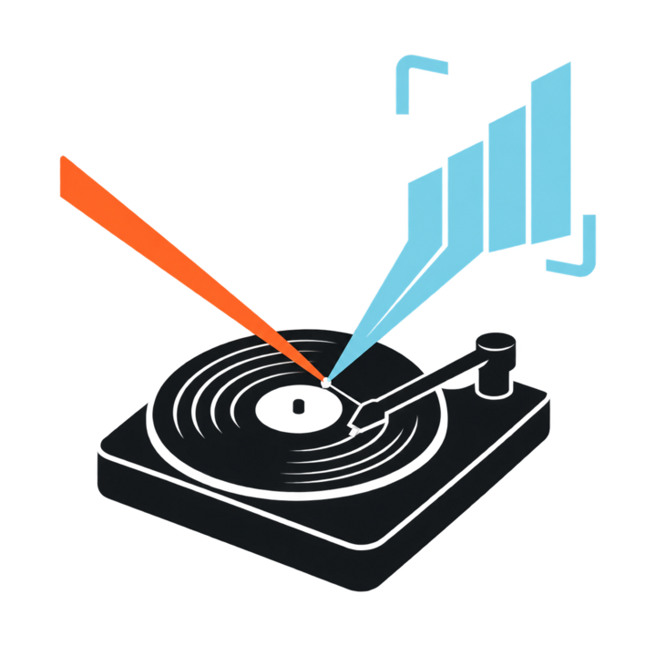

<p align="center">
  <picture>
    <source media="(prefers-color-scheme: dark)" srcset="docs/assets/setcast-logo-dark.png">
    <source media="(prefers-color-scheme: light)" srcset="docs/assets/setcast-logo-light.png">
    
  </picture>
</p>

# Setcast

Turn recorded DJ sets into polished, audio-reactive videos ready for YouTube. Give Setcast an
audio file, tracklist, and background art; it renders a broadcast-quality MP4 with a themeable
now-playing panel, deck indicators, and spectrum visuals. The default look is dark, sterile sci-fi
with one rust accent, made for neurofunk, techstep, and jungle.

Everything is a timestamped event on one timeline (`track_start`, `drop`, `breakdown`, …). Visual
behavior subscribes to events; audio features drive CSS custom properties through a modulation
matrix. The same components are designed to run live as an OBS overlay later ("stream once,
publish twice"); v1 is the offline render.

## Quickstart

Prerequisites: [Vite+](https://vite.plus) (`curl -fsSL https://vite.plus | bash`) and Node 26.

```sh
vp install && vp run demo-assets
cd examples/demo && vp run render
```

That renders `examples/demo/out/demo.mp4` (2:34, 1080p30, h264 + aac). Use
`vp run render --range 0:30-0:45` for a quick slice, or `vp run preview` to open the set in
Remotion Studio. The first render downloads Chrome Headless Shell (~100 MB) once.

To start your own project (inside this repo the binary is `vp exec setcast`; once published,
`npm i -g @setcast/cli` gives you `setcast`):

```sh
vp exec setcast init my-set --demo   # or without --demo, then set audio: in setcast.yaml
cd my-set && vp exec setcast render
```

## A project is a directory

```
my-set/
  setcast.yaml      # everything below
  assets/mix.wav    # your audio (wav, mp3, m4a, flac)
  assets/bg.svg     # background art (png/jpg/svg, or mp4/mov/webm for a looping video)
```

```yaml
title: Sterile Session 01
audio: assets/mix.wav
background: assets/bg.svg
theme: sterile-tech          # built-in name, or a path to your own .css
bpm: 174                     # gives CSS --beat and --bar; `setcast analyze --write` fills it in
output: { width: 1920, height: 1080, fps: 30, file: out/set.mp4, crf: 18, jpegQuality: 95 }
deckOrder: [A, B]            # decks tracks rotate through when they name none

tracks:                      # becomes track_start events; decks alternate A/B if omitted
  - { time: 0:00, artist: Noisia, title: Stigma, label: Vision }
  - { time: 4:12, artist: ID, title: ID, deck: B }

events:                      # drop, double_drop, breakdown, buildup, rewind, switch, chapter
  - { type: drop, time: 1:04 }
  - { type: breakdown, time: 3:30 }

modulation:                  # audio and timeline → CSS custom properties (--mod-<target>)
  - { source: bass, target: bg-zoom, range: [1, 1.06], curve: pow2, smooth: 0.08, when: drop }
  - { source: since:drop, target: flash, range: [0, 1], window: 0.8, curve: pow2 }

visualizer: { name: spectrum, bars: 48, gain: 1 }   # or { name: radial, radius: 0.3, spin: 2 }
panel: { dwell: 14, fade: 1.2 }   # seconds the now-playing panel stays up; dwell 0 keeps it up
css: overrides.css           # optional, appended after the theme
```

Commands: `setcast init`, `import <tracklist.txt|.cue> [--write]`, `analyze [--write]` (reads the audio
and drafts drop / breakdown events plus the tempo), `preview`, `render [--range A-B] [--bundle]` (the MP4; `--bundle` also writes the thumbnail and description next to it),
`still [--at 1:04]` (one frame as an image, for the thumbnail), `chapters` (YouTube description
with timestamps, warning about anything that would stop YouTube showing them), and the roadmap
stub `live`.

## Customize without JavaScript

Themes are CSS. Copy `packages/themes/sterile-tech/theme.css`, change the variables
(`--accent`, `--panel-bg`, `--blur`, `--font-display`, …) or restyle any `.sc-*` class, and point
`theme:` at your file. Modulation routes expose audio as `--mod-<target>` variables, so
`box-shadow: 0 0 calc(var(--mod-panel-glow) * 60px) var(--accent)` reacts to the music with no
code. The stage root also carries the timeline itself – `data-section`, `data-deck`, `--set-progress`,
and seconds in `--since-drop`, `--until-drop`, `--until-breakdown`, `--since-rewind`,
`--section-time` and friends – so
`clamp(0, 1 - var(--since-drop) / 0.7, 1)` is a flash on every drop,
`width: calc(var(--set-progress) * 100%)` is a progress bar, and with `bpm:` set, `--beat` and
`--bar` run 0..1 on the grid so `scale(calc(1 + 0.4 * (1 - var(--beat))))` pulses in time. Vertical output is
`output: { width: 1080, height: 1920 }`; the stage is a CSS size container, so a theme adapts
with `@container (aspect-ratio < 1) { ... }` (sterile-tech does). Plugins (visualizers, importers,
themes as npm packages) are the escape hatch for the rest.

## Renderer

Setcast v1 renders with [Remotion](https://www.remotion.dev), isolated in one adapter package.
Nothing else in the project imports Remotion (the linter and a dependency-graph check enforce
it), so the renderer can be replaced; a Playwright + FFmpeg renderer is planned. Remotion has its
own [license terms](https://www.remotion.dev/license); check whether they apply to you.

## Develop

See [AGENTS.md](AGENTS.md) for the architecture, contracts, decisions, and workflow.
`vp check`, `vp test`, `vp run smoke` are the loop.

MIT © Jacek Galanciak
