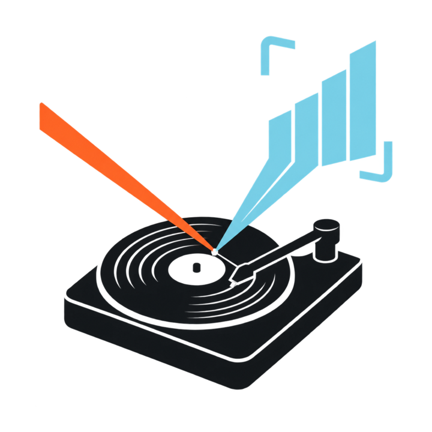
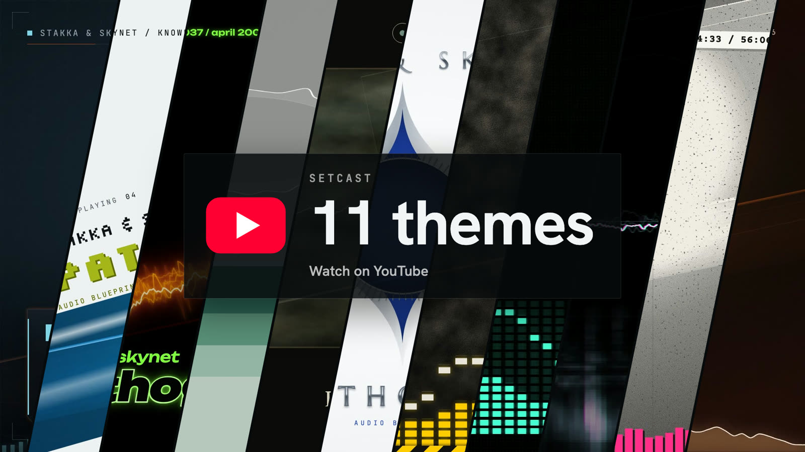

<p align="center">
  <picture>
    <source media="(prefers-color-scheme: dark)" srcset="docs/assets/setcast-logo-dark.png">
    <source media="(prefers-color-scheme: light)" srcset="docs/assets/setcast-logo-light.png">
    
  </picture>
</p>

# Setcast

Setcast turns a recorded DJ set into a video ready for YouTube. Give it the mix, the tracklist
and a background image, and it renders an MP4 in which the artist and title change with every
track, a clock runs through the set, and the visuals move with the music.

It is made for DJs who publish their mixes on YouTube and want more than a still image over the
audio, without spending an evening in a video editor for every set. You describe the set in one
YAML file and pick one of 11 themes. Themes are plain CSS, so if you can edit a stylesheet you can
change anything on screen, and you never need JavaScript. The default look is dark, sterile
sci-fi, made for neurofunk, techstep and jungle; the other themes range from a photocopied rave
flyer to the fluorescent display of a 90s CD deck.

[](https://www.youtube.com/watch?v=-emCbgmZilo)

▶ [Watch one set in all 11 themes on YouTube](https://www.youtube.com/watch?v=-emCbgmZilo) (5:31)

## What you get

- **A now-playing panel that follows the tracklist.** Artist, title and label change with each
  track, and the deck letter shows which deck is up. A header shows the set title and the clock.
- **Visuals that react to the music.** Spectrum bars, a radial ring, level meters, an
  oscilloscope, a vectorscope, a scrolling spectrogram and a strip showing the whole set, all
  driven by the bass, mids, highs and beat of your mix.
- **The moments of the set on screen.** Mark drops, breakdowns, buildups and rewinds, and the
  theme reacts with a flash, a shake or a tear in the picture. `setcast analyze` reads the mix,
  drafts the drops and breakdowns, and estimates the tempo, so beat-synced effects stay on the beat.
- **Everything the upload needs.** The YouTube description with chapters from your tracklist, a
  thumbnail, and 45-second promo clips cut around the drops. Render at 9:16 for Shorts and Reels.
- **Backgrounds that fit the set.** A still image or a looping video, optionally a different one
  for each track, crossfading at the track change.
- **Tracklists you already have.** Import a plain `MM:SS Artist - Title` list or a `.cue` file.

## Themes

Switch themes with one line in `setcast.yaml` (`theme: bristol`), or try one without editing
anything: `setcast still --theme bristol`. Each theme brings its own visualizers and reactions, so
the name alone gives you the look as designed. A theme can also be a path to your own `.css`.

| theme           | look                                                                                    |
| --------------- | --------------------------------------------------------------------------------------- |
| `sterile-tech`  | the default: cold steel, frosted glass, one rust accent, a scan line on every drop       |
| `escapement`    | white paper, a cyan band of the art, pixel capitals, a dial that ticks on the beat       |
| `long-exposure` | a night shot: the scopes as sodium-amber light trails, lime-lit lowercase                |
| `bristol`       | a flat grey field, a white contour, the set in stacked green stripes                     |
| `patina`        | a worn bronze print in a dark frame, small tracked capitals, one vibrating string        |
| `quicksilver`   | a silver field, a chrome spindle around a cobalt orb, spaced chrome capitals             |
| `bunker`        | stencil on concrete, hazard tape on the beat, the room shaking on the drop               |
| `vfd`           | a 90s deck's fluorescent display: dot matrix, lamp cells with peak hold (`--phosphor`)   |
| `interference`  | a corrupted signal: channels split with the bass, the picture tearing on the drop        |
| `pirate`        | a photocopied rave flyer: a worn grey copy, toner dust, one fluoro color (`--fluoro`)    |
| `afterhours`    | warm and late: amber and plum, an italic serif, the frame ducking with the kick          |

## Get started

Setcast is not on npm yet, so you run it from a clone of this repository. You need Node 26 and
[Vite+](https://vite.plus):

```sh
curl -fsSL https://vite.plus | bash       # installs vp
git clone https://github.com/razorjack/setcast && cd setcast
vp install
```

Try the demo set first:

```sh
vp run demo-assets                        # generates the demo audio
cd examples/demo && vp run render
```

That renders `examples/demo/out/demo.mp4` (2:34, 1080p30, h264 + aac). The first render
downloads Chrome Headless Shell (about 100 MB) once.

Then start your own project:

```sh
vp exec setcast init my-set               # asks for the title, the mix, the frame rate and a theme
cd my-set && vp exec setcast render
```

Setcast reads everything from the project directory, so put your mix inside it (for example
`my-set/assets/mix.wav`). `init --demo` fills the project with a generated 40-second demo track
instead. Inside the clone the command is `vp exec setcast`; the rest of this README writes it as
`setcast`, which is what `npm i -g @setcast/cli` will give you once Setcast is published.

> [!WARNING]
> Setcast renders the video frame by frame in a headless browser, so a full render takes a
> while. A one-hour set can take two hours or more, depending on your computer. Check the look
> on a slice first with `setcast render --range 1:00-1:30`, or a single frame with `setcast still`.

## Describe a set

A project is a directory:

```
my-set/
  setcast.yaml      # everything below
  assets/mix.wav    # your audio (wav, mp3, m4a, flac)
  assets/bg.svg     # background art (png/jpg/svg, or mp4/mov/webm for a looping video)
```

```yaml
title: Sterile Session 01
audio: assets/mix.wav
background: assets/bg.svg
theme: sterile-tech          # built-in name, or a path to your own .css
bpm: 174                     # gives CSS --beat and --bar; `setcast analyze --write` fills it in
beatOffset: 0.12             # seconds to the first beat; analyze fills it in with bpm
output: { width: 1920, height: 1080, fps: 30, file: out/set.mp4, crf: 18, jpegQuality: 95 }
deckOrder: [A, B]            # decks tracks rotate through when they name none

tracks:                      # becomes track_start events; decks alternate A/B if omitted
  - { time: 0:00, artist: Noisia, title: Stigma, label: Vision }
  - { time: 4:12, artist: ID, title: ID, deck: B, background: assets/id.jpg }  # its own art

events:                      # drop, double_drop, breakdown, buildup, rewind, switch, chapter
  - { type: drop, time: 1:04 }
  - { type: breakdown, time: 3:30 }

modulation:                  # audio and timeline → CSS custom properties (--mod-<target>)
  - { source: bass, target: bg-zoom, range: [1, 1.06], curve: pow2, smooth: 0.08, when: drop }
  - { source: since:drop, target: flash, range: [0, 1], window: 0.8, curve: pow2 }
  - { source: beat, target: kick, curve: pow3, when: drop }   # 1 on every beat, needs bpm:

visualizer: { name: spectrum, bars: 48, gain: 1 }   # or a list, or leave it to the theme; see Visualizers
panel: { dwell: 14, fade: 1.2 }   # seconds the now-playing panel stays up; dwell 0 keeps it up
css: overrides.css           # optional, appended after the theme
```

Times accept `1:23`, `1:23.5`, `1:02:03` or plain seconds.

## Commands

| command            | does                                                                                             |
| ------------------ | ------------------------------------------------------------------------------------------------ |
| `setcast init`     | scaffolds a project; `--demo` includes a generated demo track                                    |
| `setcast import`   | turns a tracklist file (plain text or `.cue`) into `tracks:`; `--write` adds them to the project |
| `setcast analyze`  | reads the audio and drafts drop and breakdown events on the beat grid, plus the tempo; `--write` merges them |
| `setcast preview`  | opens the set in Remotion Studio                                                                 |
| `setcast render`   | renders the MP4; `--range A-B` renders a slice, `--bundle` also writes the thumbnail and description |
| `setcast clip`     | cuts a 45 s promo clip around a drop; `--at 1:04` picks one, `--all` cuts one per drop            |
| `setcast still`    | renders one frame as an image, for the thumbnail; `--at 1:04` picks the moment                   |
| `setcast chapters` | prints the YouTube description with chapters and warns about anything that would stop YouTube showing them |
| `setcast live`     | planned: live overlay mode                                                                       |

`preview`, `render`, `clip` and `still` take `--theme <name>` to try a theme without editing
`setcast.yaml`, e.g. `setcast still --theme bristol --out bristol.jpg`. Run
`setcast <command> --help` for every option.

## Visualizers

`visualizer:` takes one block or a list of them. A list draws every entry in order, so later
entries sit on top; `[]` draws none. Every key except `name` is optional. Without the key, the
project draws what its theme is designed around (a spectrum for a theme that names nothing).

```yaml
visualizer:
  - { name: spectrum, style: line }
  - { name: radial, bars: 48, spin: 0 }
```

| name           | draws                                                                               | keys and defaults                                                                                          |
| -------------- | ----------------------------------------------------------------------------------- | ---------------------------------------------------------------------------------------------------------- |
| `spectrum`     | mirrored bars along the bottom, bass centered                                       | `style: bars` (or `line`), `bars: 48`, `gain: 1`, `floor: 0.02`, `gap: 0.5`, `segments: 0` (cells per bar), `peak: 0` |
| `radial`       | bars around a ring, bass at the bottom                                              | `style: bars` (or `line`), `bars: 40`, `radius: 0.3`, `length: 0.18`, `gain: 1`, `floor: 0.03`, `spin: 2`  |
| `meters`       | level meters on the left                                                            | `bands: [bass, mids, highs, rms]` (also `onset`), `gain: 1`, `floor: 0`, `segments: 16`, `peak: 0`          |
| `oscilloscope` | the waveform as one trace near the bottom                                           | `gain: 1`, `trail: 0`                                                                                      |
| `vectorscope`  | left against right in a circle, inside the radial ring                              | `gain: 1`, `trail: 0`                                                                                      |
| `spectrogram`  | the last seconds of spectrum scrolling left, bass at the bottom                     | `seconds: 4` (at most 8), `gain: 1`                                                                        |
| `overview`     | the whole set as a strip under the header, with track and drop marks and a playhead | none                                                                                                       |

`gain` scales the levels (real masters are louder in the highs than the demo), `floor` keeps a
baseline in silence, and `spin` is degrees per second. `peak` is the seconds a marker holds each
bar's highest level before it falls, as on a hi-fi analyzer (`0` draws none, at most 4). The
scopes draw the last 1/30 s of audio; `trail: 6` also draws the six 1/30 s before it behind the
current trace, for the theme to fade into an afterimage (at most 12).
The vectorscope shows stereo width, so a mono mix draws a vertical line; so does the demo, which
has the same audio in both channels. The overview reads the whole audio file before rendering,
which takes a few seconds for a long set.

Placement and appearance are CSS. Set `--radial-size` and `--vectorscope-size` on `.setcast`,
which keeps the vectorscope centered in the ring, or `--spectrum-height`, `--meters-top`,
`--oscilloscope-height`, `--spectrogram-height` and `--overview-height`, or restyle
`.sc-spectrum`, `.sc-radial`, `.sc-meters`, `.sc-oscilloscope`, `.sc-vectorscope`,
`.sc-spectrogram` and `.sc-overview` (see [AGENTS.md](AGENTS.md#css-contract) for their elements).
The spectrogram is a canvas: its CSS `color` is the color of a full-strength cell.

## Customize without JavaScript

Themes are CSS. To adjust a built-in theme, set its variables (`--accent`, `--deck-a`,
`--panel-bg`, `--blur`, `--font-display`, …) or restyle any `.sc-*` class in a `css:` file. To
write your own, copy a theme's `theme.css` into the project and point `theme:` at it; its `url()`s
point at `../fonts` and `../textures` in `packages/themes`, so copy what it uses or swap in your
own. `vp run theme-stills [dir] --at 1:51` renders the same moment in every theme and tiles them
into `out/themes/contact-*.jpg`, which helps when comparing.

Modulation routes expose audio as `--mod-<target>` variables, so
`box-shadow: 0 0 calc(var(--mod-panel-glow) * 60px) var(--accent)` reacts to the music with no
code. The stage root also carries the timeline itself – `data-section`, `data-deck`,
`--set-progress`, and seconds in `--since-drop`, `--until-drop`, `--until-breakdown`,
`--since-rewind`, `--section-time` and friends – so `clamp(0, 1 - var(--since-drop) / 0.7, 1)` is
a flash on every drop, `width: calc(var(--set-progress) * 100%)` is a progress bar, and with
`bpm:` set, `--beat` and `--bar` run 0..1 on the grid so
`scale(calc(1 + 0.4 * (1 - var(--beat))))` pulses in time.

Vertical output is `output: { width: 1080, height: 1920 }`. The stage is a CSS size container, so
a theme adapts with `@container (aspect-ratio < 1) { ... }` (sterile-tech does). Plugins
(visualizers, importers, themes as npm packages) are the escape hatch for the rest.

## Excerpts from longer mixes

For an excerpt from a longer mix, set `clockOffset: 14:03` to show the original mix time.
A 5:31 excerpt then opens at `14:03 / 19:34`. The default is `0`; seconds and timecodes
are accepted. This changes only the displayed clock and endpoint. Track and event times,
`beatOffset`, `--range`, `--at`, and YouTube chapters still use the audio file's own timeline.
Set `clockTotal: 56:06` to replace the displayed endpoint with the full mix duration, showing
`14:03 / 56:06`. This accepts a positive duration in seconds or as a timecode and does not
extend the rendered video.
Use `trackNumberOffset: 2` when the excerpt begins with track 3. The panel then displays
`03`, `04`, and so on, without a total because the excerpt does not contain the full tracklist.
The default `0` keeps the usual current/total counter. This does not change event indices,
deck assignment, or track timing.

## How it works

Everything in a set is a timestamped event on one timeline (`track_start`, `drop`, `breakdown`,
…). Visual behavior subscribes to events, and audio features drive CSS custom properties through
a modulation matrix. Motion is computed from the timeline for each frame, never from the
browser's clock, so every frame renders the same way every time. The same components are
designed to run live as an OBS overlay later, driven by events from DJ hardware ("stream once,
publish twice"); v1 is the offline render.

## Renderer

Setcast v1 renders with [Remotion](https://www.remotion.dev), isolated in one adapter package.
Nothing else in the project imports Remotion (the linter and a dependency-graph check enforce
it), so the renderer can be replaced; a Playwright + FFmpeg renderer is planned. Remotion has its
own [license terms](https://www.remotion.dev/license); check whether they apply to you.

## Develop

See [AGENTS.md](AGENTS.md) for the architecture, contracts, decisions, and workflow.
`vp check`, `vp test`, `vp run smoke` are the loop.

MIT © Jacek Galanciak
